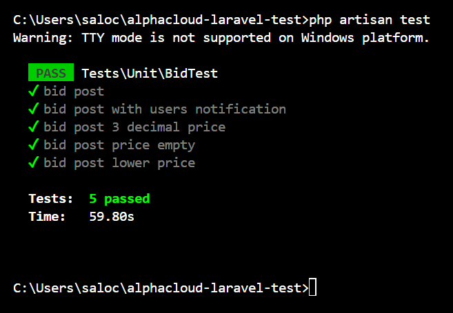

This is the updated code for the assessment. You must provide your own .env file for this.

The testing is a bit hard because there was a grammatical error in one of the test validation.

Attempted to use the Request class for validation but it was not working as expected. I had to use the Validator class instead.

Tried chunking and batch insert to speed up the notification table insert. Probably thread management is needed but I am not too familiar with using it on Laravel.

### Test Result screenshot...


Original readme follows...
---
# Laravel **Assessment**

# 👋 Intro

---

**Assessment Duration**

Examinee is given 2 days to complete the assessment. For any questions regarding the exam please send inquiry to [hr@alphacloud.com.my](mailto:hr@alphacloud.com.my) or [jiajun-ong@alphacloud.com.my](mailto:jiajun-ong@alphacloud.com.my).

### 💻 Local Environment Requirements

---

- PHP Version > 8
- Laravel 9

### 🪄 **Steps to Replicate**

---

- [ ]  Clone the repository.
- [ ]  Setup database details in `.env`
- [ ]  Setup Laravel environment.
    
    ```powershell
    composer install
    ```
    
- [ ]  Run migration.
    
    ```powershell
    php artisan migrate
    php aritsan db:seed
    ```
    <aside>
💡 `php aritsan db:seed` will generate 5000 users into the db. It might take some time to complete it.

</aside>

# 👨‍💻 Challenge

---

**You are required to complete 2 challenging tasks. Both tasks does not require the use of user interface. Only Laravel logic is tested in this challenge.**

## 📝 TASK 1: REST API

In this challenge, your task is to implement a simple REST API for bidder to submit their bid.

### 📃 Instruction

---

Each bid is a JSON entry with the following keys:

- `id`: The unique bid ID. (Integer)
- `price`: The price of the bid. (Float)
- `user_id`: The user of the bid. (Integer)

Here is an example of a bid JSON object:

```json
{
    "user_id": 1,
    "price": 200.00 // two decimal is required
}
```

You are provided with the implementation of the Bid model. The task is to implement the REST service that exposes the `/bid` endpoint, which allows bidder to add bid in the following way:

`POST` request to `/bid`:

- Validates the following conditions:
    - `user_id` is provided & must exists in the `users` table.
    - `price` is provided, must be a number, only allow 2 decimal & must be the highest value in the bid table.
    
- If any of the above validate requirements fail, the server should return the response code 422 and the following message:
    - If the `price` is empty, then return message `The bid price is required!`
    - If the `price` is lower, than return message `The bid price cannot be lower than :price`
    - Other error messages should remain Laravel default response validation format.
    
    Below is the example of the response.
    
    ```json
    {
        "message": "....",
        "errors": {
            "price": [
                "The bid price cannot be lower than 20.00" // two decimal is required
            ]
        }
    }
    ```
    

- Otherwise, in the case of a successful request, the server should return the response code 201 and the information below in JSON format.

```json
{
    "message": "Success",
    "data": {
        "full_name": "Ethel Willms", // user.first_name + user.last_name
        "price": "23.00" // two decimal is required
    }
}
```

### 💡 Bonus Tip

---

- [ ]  Use request classes for validation.
- [ ]  Implement a Service Pattern.
- [ ]  Implement a model accessor.

## 📢 TASK 2: Notification

---

In this challenge, your task is to implement a simple notification to notify all the users when a new bid is created. The user will receive a message with their previous bid price.

### 🎯 Goals

---

<aside>
💡 Please note that you are not required to send notification through any method such as email, SMS, etc. The goal is to store the message into `Notification` table.

</aside>

- [ ]  Implement an event called `BidSaved` triggered when a bid is created.
- [ ]  Implement a listener that auto-notify all user when the `BidSaved`event is triggered.
- [ ]  Run following command to create a table called `notifications`
    
    ```terminal
    php artisan notifications:table
    php artisan migrate
    ```

### 📃 Instruction

---

Each user notification will store the following keys:

- `notifiable_id`: The notifiable user. (Integer)
- `data`:  The JSON entry with the following keys as stated below (Text)
    
    ```json
    {
    	"latest_bid_price": "854.25", //two decimal is required
    	"user_last_bid_price": "614.75" //two decimal places is required
    }
    ```
    
    - `latest_bid_price`: The latest bid price
    - `user_last_bid_price`: The user previous bid price. If no bid found, return `0.00`

### 💡 Bonus Tip

---

- [ ]  Implement an event listener for the model, such as created.
- [ ]  Ensure your API can respond with blazing speed.

# 🏆 Outcome

---

Examinee is expected to send an email with attachment to their output files (preferably a zip file). Alternatively, examinee can attach a link to their GitHub Repository, Google Drive, or any other storage service to download the code. 

Run to test the application.

```php
php artisan test
```

<aside>
💡 Note: Please screenshot the outcome and send back to us

</aside>

### ✅ Excepted outcome
# Excepted outcome
```terminal
PASS  Tests\Unit\BidTest
✓ bid post
✓ bid post with users notification
✓ bid post with 3 decimal price
✓ bid post price empty
✓ bid post lower price

  Tests:  5 passed
  Time:   17.94s
  ```
